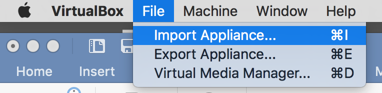
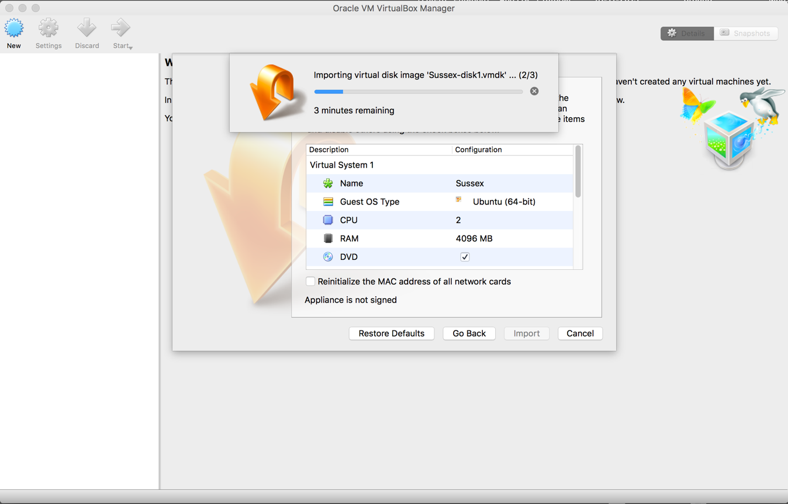
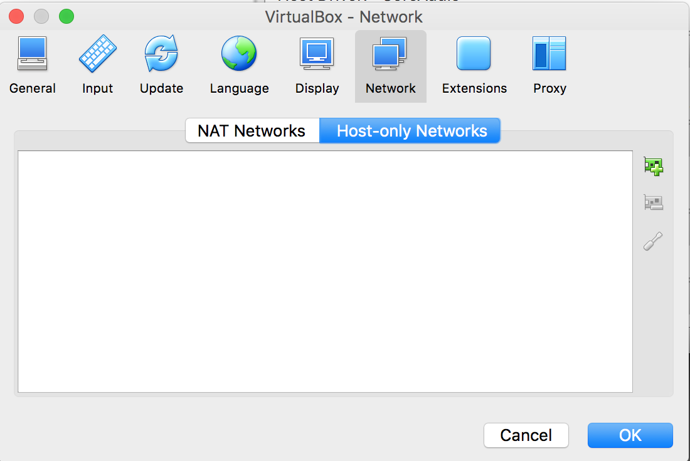
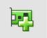
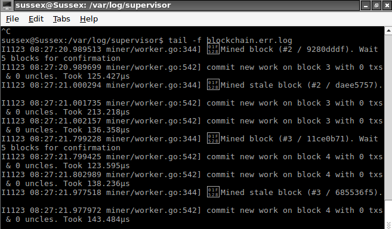
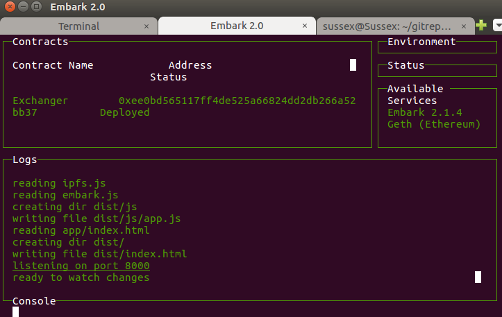

# VirtualBox Install

These are the installation instructions for running the _The Answer_ and _Currency Exchange_ demonstrator applications from within VirtualBox.

These instructions assume you have access to the file `Sussex.ova`. If you do not, please email s.huckle@sussex.ac.uk.

## Dependencies

Download and install [VirtualBox](https://www.virtualbox.org). If you are using Windows, you may wish to install [PuTTY](http://www.chiark.greenend.org.uk/~sgtatham/putty/download.html), which will allow you to `ssh` onto the VirtualBox Guest OS (`ssh -l sussex 192.168.56.100`). On a MAC or Linux machine, you will be able to do that from a terminal window.

## Import the Tutorial

The following steps show you how to install the pre-installed image, `Sussex.ova`, which contains all the code and tools you will need for this tutorial.

**Step 1:** Import the appliance

Open [VirtualBox](https://www.virtualbox.org) and select the command **Import Appliance** from the VirtualBox _File_ menu. See Figure 1.

Select the file `Sussex.ova` from the USB drive supplied. See Figure 2.

Once the VirtualBox image is installed you should have an Ubunto 64-bit operating system called Sussex, which is currently Powered Off, inside your VirtualBox Manager. See Figure 3.

You will be creating (or configuring) the smart contract applications _The Answer_ and _Currency Exchange_ demonstrator applications from within this version of Ubunto running inside VirtualBox.

**Step 2:** Create the Network

Create a `Host-only Network`. On MAC OS X, Go to `VirtualBox VM` on the main menu bar, select `Preferences`, `Network`, `Host-only Networks`. See Figure 4.

Add a new Host-only Network: . See Figure 5.

Edit the default `vboxnet0` and make sure the DHCP Server is disabled. See Figure 6.

Click **OK** a couple of times to return to the VirtualBox main screen.

# Install _The Answer_

You have six steps to follow to install and write the smart contract for running _The Answer_.

1. Start the Sussex Ubunto Operating System.
2. Login to the OS and load the Atom text editor.
3. Write the smart contract (_The Answer_ — a blockchain equivalent of _Hello World_).
4. Deploy the smart contract to the blockchain.
5. Install the front-end (the user interface) to the smart contract.
6. Load up the front-end, which is a simple web page and use the smart contract, i.e. play with the simple interface.

# Preamble - _The Answer_ Architecture Overview

_The Answer_ has the following architecture:

1. An [Ethereum](https://www.ethereum.org/) blockchain back end. _The Answer_ uses the [Embark Framework](https://github.com/iurimatias/embark-framework) to ease smart contract deployment. Once you have booted the VirtualBox Guest OS and logged in, you will find this in the directory `/home/sussex/gitrepos/ExchangeCurrency/src/TheAnswer`.
2. A [React](https://facebook.github.io/react/) Javascript front end. You will find this in the directory `/home/sussex/gitrepos/ExchangeCurrency/src/react-the-answer`.

`geth` is the the command line interface for running a full [Ethereum](https://www.ethereum.org/) node, and the command `embark blockchain`, run from the directory `/home/sussex/gitrepos/ExchangeCurrency/src/TheAnswer`, will load a correctly configured `geth` for you. However, you do need to do that because `embark blockchain` has been called at system startup. In fact, if you load a terminal window (by launching `LXTerminal` from the `Application Launch Bar`: ), the command `pgrep -a geth` will show you the running process.

Additionally, there is a process loaded at startup, `webpack -d watch`, which is monitoring for changes in the javascript front end directory, `/home/sussex/gitrepos/ExchangeCurrency/src/react-the-answer`. Hence, when you make changes to the front end later, the build process is done for you.

Finally, there's another process, again loaded at startup, that establishes a simple web-server on port 8082. You'll use that to communicate with the front end javascript application. `pgrep -a node | grep the-answer` will show the build and web server processes.

## 1. Start the Guest OS

**Start** the Guest OS `Sussex`.

## 2. Login and Load the Text Editor `Atom`

Once the Guest OS has booted, you will see a login prompt. Login to the account `sussex` with the password `h3ll0w0rld`:

Launch `atom` from the `Application Launch Bar`:

From `atom`, open the folder `/home/sussex/gitrepos/ExchangeCurrency`:

## 3. Write the Smart Contract

In `atom`, open the file `src/TheAnswer/app/contracts/TheAnswer.sol` and edit it so it looks **EXACTLY** like this:

    pragma solidity ^0.4.2;

    // The answer to any question.

    contract TheAnswer {

      string private question;
      uint256 constant answer = 42;

      event Question(string question, uint256 answer);

      function TheAnswer () {
         question = "";
      }

      function setQuestion(string thisQuestion) public {
        question = thisQuestion;
        Question(question,answer);
      }
    }

Save the file.

## 4. Deploy the Contract

Load a terminal window by launching `LXTerminal`  from the `Application Launch Bar`:

Change directory to `/home/sussex/gitrepos/ExchangeCurrency/src/TheAnswer` (`cd /home/sussex/gitrepos/ExchangeCurrency/src/TheAnswer`). The command `embark run` will deploy the contract to the blockchain, which is running as a system daemon. `embark run` will load a console window telling you the status of the deployment. While deploying, the contract will show `pending`. Once the contract has been successfully deployed (it may take up to 5 minutes or more), the screen will look similar to the following:

**Note**: If you open another terminal window (there are at least three ways to do this - either by launching another `LXTerminal`, or by creating a new tab within the existing `LXTerminal` window (`shift+ctrl+t`), or by using `ssh`), you can tail the blockchain log (`tail -f /var/log/supervisor/blockchain.err.log`) to see how the mining is doing. You should see a block commit when the contract is pending, and a mined block once it has been deployed:

## 5. Install the Front End

The [React](https://facebook.github.io/react/) Javascript front end has been written for you.

However, you still need to ensure the front end has the correct value for its smart contract address. Open the file `/home/sussex/gitrepos/ExchangeCurrency/src/react-the-answer/app/index.jsx` in `atom`; the constructor function variable `contractAddress` is where the code stores the address. To get the necessary value, open the file `/home/sussex/gitrepos/ExchangeCurrency/src/TheAnswer/chains.json` (from within the `LXTerminal` window, run `cat /home/sussex/gitrepos/ExchangeCurrency/src/TheAnswer/chains.json`). The `contractAddress` variable requires the value of the `address` json key - it will look something similar to:`0x11bcf0e4dfeacd5d68a05180ceee4d50cc7cf720`. Copy that value to the `contractAddress` variable and save `/home/sussex/gitrepos/ExchangeCurrency/src/react-the-answer/app/index.jsx`.

There is a daemon running on the VirtualBox Guest OS that will notice the change you just made. It will build the front end application for you.   

## 6. Load the URI

Load a web browser by launching `Web Browser` from the `Application Launch Bar`:

Go to the following URL:

- http://blockchain.sussex.ac.uk:8082

You should see a screen like this:

# Using *The Answer* Demonstrator Application

Below are the instructions for using _The Answer_.

## 1. Use _The Answer_

1. Type in a question and hit _Ask!_. The answer may take a while to appear (on some machines, it may take 5 minutes or more). Can you explain why it does not return instantly?

## 2. Examine the Front End Application

From within `atom`, open the files `src/react-the-answer/app/index.jsx`, `src/react-the-answer/app/containers/answer.jsx` and `src/react-the-answer/app/components/answer.jsx`.

1. Do you understand the architecture of the front end application? Would you architect it that way? If not, how would you build the application?
2. Why does the application use an event to get _The Answer_?

# Install The Currency Exchange Application

Below are the instructions for running the Currency Exchange demonstration from within VirtualBox.

# Preamble - The Currency Exchange Architecture Overview

The Currency Exchange application has the following architecture:

1. An [Ethereum](https://www.ethereum.org/) blockchain back end. Again, the Currency Exchange uses the [Embark Framework](https://github.com/iurimatias/embark-framework) to ease smart contract deployment. Once you have booted the VirtualBox Guest OS and logged in, you will find this in the directory `/home/sussex/gitrepos/ExchangeCurrency/src/ExchangeRates`.
2. A [React](https://facebook.github.io/react/) Javascript front end for the Currency Exchange Administrator. You will find this in the directory `/home/sussex/gitrepos/ExchangeCurrency/src/react-exchange-rates`.
3. A [React](https://facebook.github.io/react/) Javascript front end for the Currency Exchanger application itself. You will find this in the directory `/home/sussex/gitrepos/ExchangeCurrency/src/react-do-exchange`.

## 1. Start the Guest OS

If it is not already running, **Start** the Guest OS `Sussex`.

## 2. Login

If you are not already logged into the account `sussex` on the Virtual Box Guest OS, do so now. The password is `h3ll0w0rld`:

## 3. Deploy the Contract

Load a terminal window by launching `LXTerminal` from the `Application Launch Bar`:

Change directory to `/home/sussex/gitrepos/ExchangeCurrency/src/ExchangeRates` (`cd /home/sussex/gitrepos/ExchangeCurrency/src/ExchangeRates`). The smart contracts for this application have been written for you (they are much too complex to write in a single tutorial session); you just need to deploy them to the blockchain with the command `embark run`. That loads a console window telling you the status of the deployment. While deploying, the contract will show `pending`. The console will display contract addresses once they have been successfully deployed (to deploy every contract, it may take up to 5 minutes or more) - the screen will look similar to the following:

## 4. Load Atom (Text Editor)

If `atom` is not already running, launch it now from the `Application Launch Bar`:

Open the folder `/home/sussex/gitrepos/ExchangeCurrency`:

## 5. Install the Front End Currency Exchange Administrator

The [React](https://facebook.github.io/react/) Javascript front end has been written for you.

However, you still need to ensure the front end has the correct value for its smart contract address. Open the file `src/react-exchange-rates/app/index.jsx` in `atom`; the constructor function variable `contractAddress` is where the code stores the address. To get the necessary value, open the file `/home/sussex/gitrepos/ExchangeCurrency/src/ExchangeRates/chains.json` (from within the `LXTerminal` window, run `cat /home/sussex/gitrepos/ExchangeCurrency/src/ExchangeRates/chains.json`). The `contractAddress` variable requires the value of the `address` json key for the contract `Exchanger` (**Note**: not `Exchange` - that's its abstract interface) - the address will look something similar to:`0x11bcf0e4dfeacd5d68a05180ceee4d50cc7cf720`. Copy that value to the `contractAddress` variable and save `src/react-exchange-rates/app/index.jsx`.

There is a daemon running on the VirtualBox Guest OS that will notice the change you just made. It will build the front end application for you.

## 6. Install the Front End Currency Exchange Application

Similarly, you still need to ensure the front end has the correct value for its smart contract address. Open the file `src/react-do-exchange/app/index.jsx` and make sure the `contractAddress` variable has the same value as above. Once that's so, save the file. The daemon will notice the change you just made and will build the front end application for you.

## 7. Load the URIs

Load a web browser by launching `Web Browser` from the `Application Launch Bar`:

Load the following URIs:

  - The Currency Exchange Administrator
    - http://blockchain.sussex.ac.uk:8081
  - The Currency Exchanger
    - http://blockchain.sussex.ac.uk:8080

# Using the Currency Exchange Demonstrator Application

Below are the instructions for using the Currency Exchange application.

## 1. Run the Currency Exchange Administrator

1. Fund the contract from the Administrator account. Why didn't the funding happen instantly (it may take up to 5 minutes or more on some machines)? After the funding, you might have expected the Administrator account to have the original funds minus those you just gave to the contract. Why is that not so?
2. Set some Exchange Rates (again, these actions may take a while to complete). Again, note that the Administrator's funds will have changed. You should now be able to explain why.

## 2. Run the Currency Exchanger

1. Choose an Exchange Rate for a currency we set above and exchange some of that currency.
2. If you successfully exchanged the currency, go back to the Currency Exchange Administrator and withdraw some of the currency just deposited.

## Known Limitations and Bugs

The application is at the early stages of development, so there are many ways it can be improved. Indeed, imagine you are part of the development team; how could you improve the product?

Below are some of the known limitations/bugs of the application. There will be (many) others too!

- You can (try) and give more Ether to the contract than the Administrator owns. What happens if you do that?
- The Administrator's Events page only shows events for the current session. It _could_ show **all** events.
- Should the Administrator set the exchange rates?
- Could this application exchange _real_ currency?
- What does the deposit do? How could it behave?
- What does a withdraw do? How could it behave?
- You can (try) and exchange for more Ether than the contract contains. What happens if you do that?
