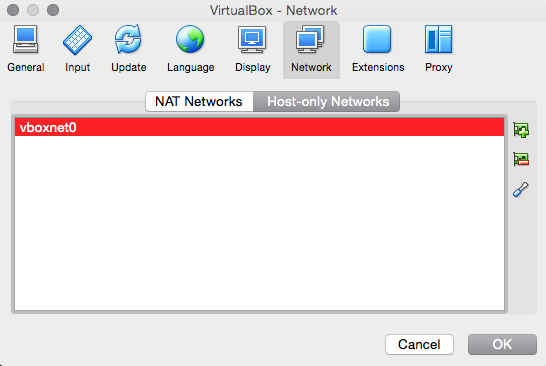
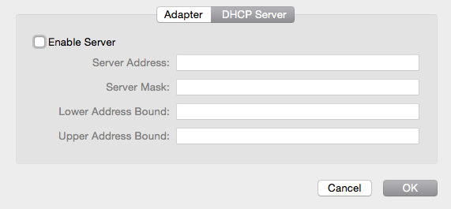

# VirtualBox Install

These are the installation instructions for running the _The Answer_ and _Currency Exchange_ demonstrator applications from within VirtualBox.

These instructions assume you have access to the file `Sussex.ova`. If you do not, please email s.huckle@sussex.ac.uk.

## Dependencies

Download and install [VirtualBox](https://www.virtualbox.org). If you are using Windows, you may wish to install [PuTTY](http://www.chiark.greenend.org.uk/~sgtatham/putty/download.html), which will allow you to `ssh` onto the VirtualBox Guest OS (`ssh -l sussex 192.168.56.100`). On a MAC or Linux machine, you will be able to do that from a terminal window.

## Important Note

If your mouse disappears while you are using VirtualBox, press the defined Host key - on a MAC this will probably be the command key, directly to the left of the spacebar. On Linux, it should be the Alt key, again, to the left of the spacebar.

## 1. Import the VirtualBox Appliance

Select the command **Import Appliance** from the VirtualBox _File_ menu. Select the file `Sussex.ova` from the USB drive supplied.

## 2. Create the Network

Create a `Host-only Network`. On MAC OS X, Go to `VirtualBox VM` on the main menu bar, select `Preferences`, `Network`, `Host-only Networks`.

Edit the default `vboxnet0`, and make sure the DHCP Server is disabled.

## 3. Install the Demo's

 For _The Answer_ demonstration, follow the instructions in [VBoxTheAnswerInstall.md](VBoxTheAnswerInstall.md). For the _Currency Exchange_ demo', follow the instructions in [VBoxCurrencyExchangeInstall.md](VBoxCurrencyExchangeInstall.md).
