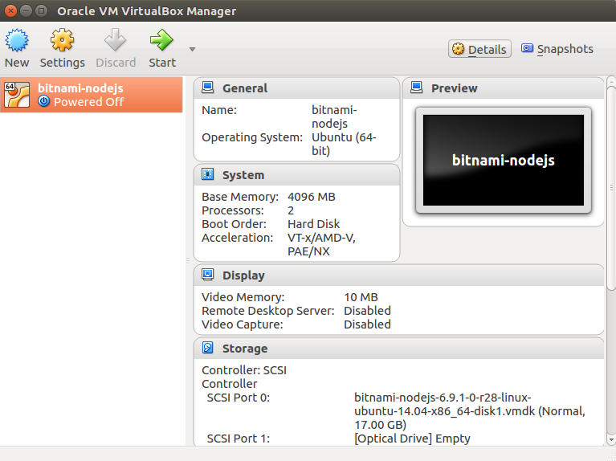
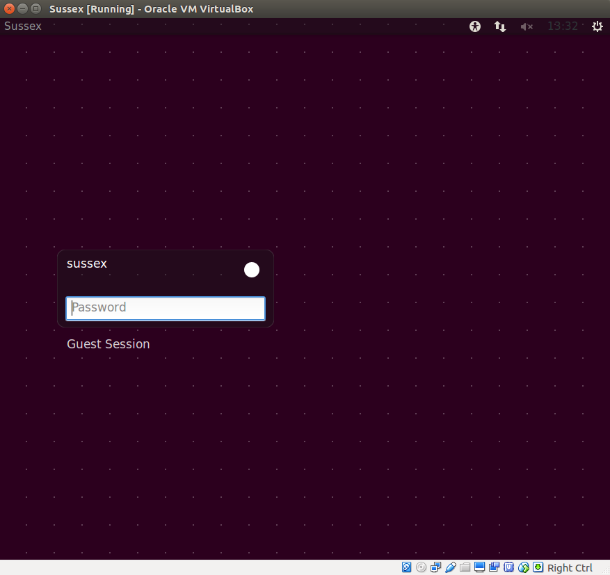
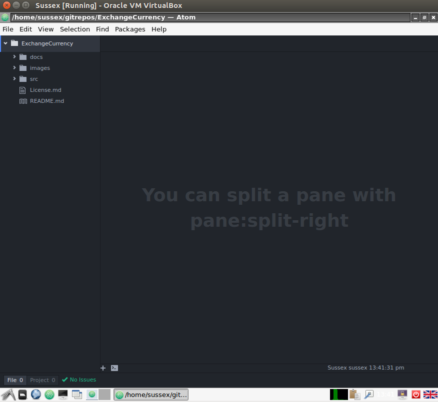
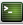
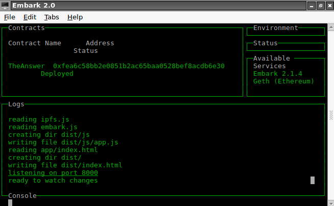
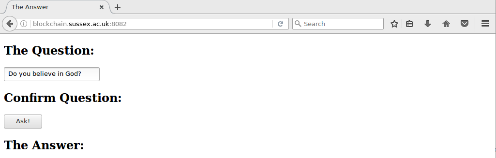

# VirtualBox _The Answer_ Demonstration

Below are the instructions for running _The Answer_ from within VirtualBox.

It is assumed you have already followed the instructions in [VBoxInstall.md](VBoxInstall.md).

## 1. Start the Guest OS

**Start** the Guest OS `Sussex`.

## 2. Login and Load Atom (Text Editor)

Once the Guest OS has booted, you will see a login prompt. Login to the account `sussex`:

- Password: h3ll0w0rld

Launch `atom` from the `Application Launch Bar`:

Open the folder `/home/sussex/gitrepos/ExchangeCurrency`:

## 3. Write the Smart Contract

Open the file `src/TheAnswer/app/contracts/TheAnswer.sol` and edit it so it looks like this:

    pragma solidity ^0.4.2;

    // The answer to any question.

    contract TheAnswer {

      string private question;
      uint256 constant answer = 42;

      event Question(string question, uint256 answer);

      function TheAnswer () {
         question = "";
      }

      function setQuestion(string thisQuestion) public {
        question = thisQuestion;
        Question(question,answer);
      }
    }

Save the file.

## 4. Deploy the Contract

Load a terminal window by launching `LXTerminal`  from the `Application Launch Bar`:

Change directory to `/home/sussex/gitrepos/ExchangeCurrency/src/TheAnswer` (`cd /home/sussex/gitrepos/ExchangeCurrency/src/TheAnswer`). The command `embark run` will deploy the contract to the running blockchain. It loads a console window telling you the status of the deployment. While deploying, the contract will show `pending`. Once the contract has been successfully deployed (it may take up to 5 minutes or more), the screen will look similar to the following:

## 5. Install the Front End

The [React](https://facebook.github.io/react/) based front end has been written for you.

However, you still need to endure the front end has the correct value for its contract address. Open the file `/home/sussex/gitrepos/ExchangeCurrency/src/react-the-answer/app/index.jsx` in `atom`; the constructor function variable `contractAddress` is where the code stores the address. To get the necessary value, open the file `/home/sussex/gitrepos/ExchangeCurrency/src/TheAnswer/chains.json` (from within the `LXTerminal` window, run `cat /home/sussex/gitrepos/ExchangeCurrency/src/TheAnswer/chains.json`). The `contractAddress` variable requires the value of the `address` json key - it will look something similar to:`0x11bcf0e4dfeacd5d68a05180ceee4d50cc7cf720`. Copy that value to the `contractAddress` variable and save the file. There is a daemon running on the VirtualBox Guest OS that will notice the change you just made. It will build the front end application for you.  

## 6. Load the URI

Load a web browser by launching `Web Browser`  from the `Application Launch Bar`:

Go to the following URL:

- http://blockchain.sussex.ac.uk:8082

You should see a screen like this:

## 7. Run the Demo

Follow the instructions in [TheAnswerDemo.md](TheAnswerDemo.md).
